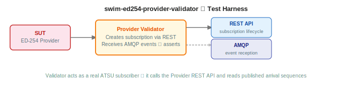

# swim-ed254-provider-validator

Interactive test harness for validating ED-254 (Extended AMAN) Arrival Sequence Service provider implementations. Acts as a consumer workstation, authenticates via Keycloak, manages subscriptions through the provider's REST API, connects to the provider's AMQP broker, captures arrival sequence messages, and runs conformance tests against the ED-254 specification.



## What it does

- **Keycloak authentication**, OAuth2/OIDC login with JWT token inspection
- **mTLS proxy**, backend proxy for secure communication with the provider REST API
- **Subscription management**, create, activate, pause, and delete subscriptions via the provider
- **AMQP message capture**, connects to the provider's broker, consumes arrival sequence events per user session
- **Conformance testing**, automated test scenarios against the provider's ED-254 API
- **Real-time console**, Server-Sent Events (SSE) stream for live operation feedback
- **Message persistence**, MariaDB storage for received events with detail viewer

---

## GET STARTED

### Prerequisites

- Java 21
- Maven 3.9+
- Podman (or any OCI-compatible runtime with Compose support)
- A running ED-254 Provider (`swim-ed254-provider`)
- TLS certificates (generate with [swim-developer-tools](https://github.com/swim-developer/swim-developer-tools))
- Shared modules installed in local Maven repo (see below)

### 0. Install shared modules

This project depends on shared modules from [swim-developer-validators](https://github.com/swim-developer/swim-developer-validators). They must be installed in your local Maven repository before building or running this project.

Clone and install once:

```bash
git clone git@github.com:swim-developer/swim-developer-validators.git
cd swim-developer-validators
./mvnw clean install -DskipTests
```

You only need to repeat this step when `swim-developer-validators` is updated.

### 1. Start the infrastructure

```bash
podman compose up -d
```

### 2. Run the validator

```bash
./mvnw quarkus:dev
```

Configure the following environment variables to point at your running provider:

```properties
SWIM_PROVIDER_API_URLS=https://localhost:8443
SWIM_PROVIDER_AMQP_HOST=localhost
SWIM_PROVIDER_AMQP_PORT=5671
KEYCLOAK_URL=https://localhost:8543
```

- UI: http://localhost:8080
- Swagger UI: http://localhost:8080/swagger-ui

### Verify, happy path

```bash
# Validator status
curl -s http://localhost:8080/api/status | jq .
```

The validator is working correctly when:
- `GET /api/status` shows the provider URL and connection details
- Opening http://localhost:8080 shows the dashboard with the Login button
- After login (Keycloak redirect), a JWT token appears on the Token page
- Creating a subscription on the Provider API page succeeds and returns a queue name
- After the provider pushes an event (via its internal API), the Messages page shows the received FIXM/ED-254 message

---

## REST API

| Method | Endpoint | Description |
|--------|----------|-------------|
| `GET` | `/api/config/keycloak` | Keycloak configuration for frontend |
| `GET` | `/api/config/provider` | Provider API URLs |
| `GET` | `/api/status` | mTLS and connection status |
| `GET` | `/api/console/stream` | SSE stream for console events |
| `GET` | `/api/user/messages` | User's received messages |
| `GET` | `/api/messages/{id}` | Message detail view |

---

## Environment variables

| Variable | Default | Description |
|----------|---------|-------------|
| `KEYCLOAK_URL` | `https://rhbk.apps.ocp4.masales.cloud` | Keycloak server URL |
| `KEYCLOAK_REALM` | `swim` | Keycloak realm name |
| `KEYCLOAK_CLIENT_ID` | `swim-public-client` | OAuth2 client ID |
| `SWIM_PROVIDER_API_URLS` |: | Comma-separated provider REST API URLs |
| `SWIM_PROVIDER_AMQP_HOST` |: | Provider's AMQP broker hostname |
| `SWIM_PROVIDER_AMQP_PORT` | `443` | Provider's AMQP broker port |
| `PROXY_MTLS_KEYSTORE_PATH` | `certs/keystore.p12` | Client certificate keystore |
| `PROXY_MTLS_KEYSTORE_PASSWORD` | `changeit` | Keystore password |
| `PROXY_MTLS_KEYSTORE_TYPE` | `PKCS12` | Keystore type |
| `PROXY_MTLS_TRUSTSTORE_PATH` | `certs/truststore.p12` | Trust store for CA certificates |
| `PROXY_MTLS_TRUSTSTORE_PASSWORD` | `changeit` | Truststore password |
| `PROXY_MTLS_TRUSTSTORE_TYPE` | `PKCS12` | Truststore type |
| `MARIADB_HOST` | `localhost` | MariaDB hostname |
| `MARIADB_PORT` | `3306` | MariaDB port |
| `MARIADB_DATABASE` | `swim_ed254_provider_validator` | Database name |
| `MARIADB_USERNAME` | `swim` | Database username |
| `MARIADB_PASSWORD` | `swim` | Database password |

---

## Container images

```
quay.io/masales/swim-ed254-provider-validator:latest
```

---

## Build

From the `swim-developer-validators/` repository root:

```bash
make ed254-provider-validator-jvm              # JVM multi-arch, build + push

make ed254-provider-validator-native-amd64     # Native amd64, build + push  (run on amd64)
make ed254-provider-validator-native-arm64     # Native arm64, build + push  (run on arm64)
make ed254-provider-validator-manifest         # Create multi-arch manifest
make ed254-provider-validator-push             # Push manifest to registry
```

Override: `make ed254-provider-validator-jvm REGISTRY=quay.io/myorg TAG=v1.2.3`

---

## Deployment

Includes a Helm chart under `src/main/helm/` with CRC and production values.

---

## License

Licensed under the [Apache License 2.0](LICENSE).
